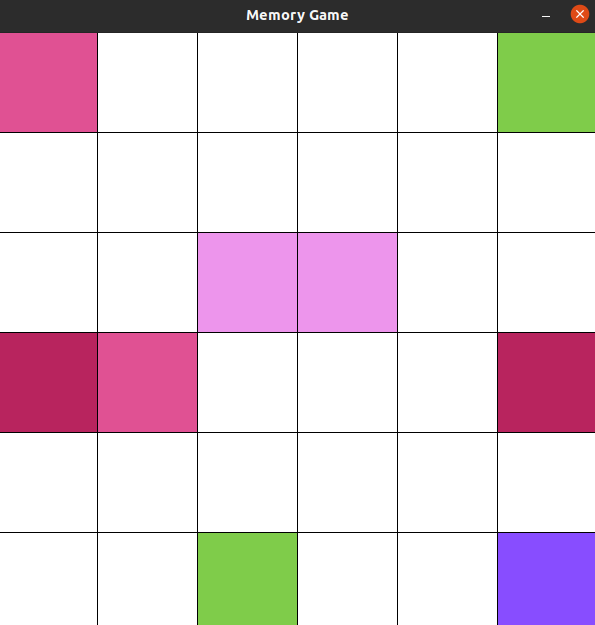

# MemoryGame

## Tech stack:

* C++
* SFML

## Game Rules:

User must find all pairs of colors.
You can click on two squares per turn and if you found pair,
color will stay discovered otherwise you must find again.

Good luck and have fun :)



<br>

# How to setup project

## Requirements

* SFML library installed

## My workflow

When i wrote this app, i used g++ on linux to compile project but you can use any other C++ compiler you want.

## Linux

I created short script to speed up compile process, you can run it and build project by enter this command in terminal:

```
./build.sh
```

## Windows

On windows you can compile project by following these documentation: https://www.sfml-dev.org/tutorials/2.5/#getting-started
